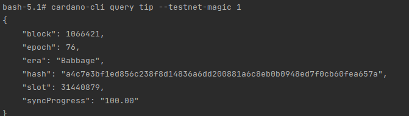

# Metabus modules and implementation

Expose services for submitting data to Cardano blockchain and getting result from blockchain.

## Modules

* **cardano-metabus-api** - Spring Boot API for Metabus
* **cardano-metabus-common** - Library provides common classes for other Metabus's modules
* **cardano-metabus-entity-common** - Library provides common entities for other Metabus's modules
* **cardano-metabus-jobproducer** - Spring Boot API for receiving job data from **cardano-metabus-api** and then publish
  job to Kafka topic
* **cardano-metabus-offchain-storage** - Store offchain data that extracted from job data (original data comes from **
  cardano-metabus-api**). Metabus then will create hash base on this offchain data and submit this hash to blockchain
  instead of origin data.
* **cardano-metabus-txsubmiter** - Spring Boot API for getting job from Kafka and submitting to blockchain via a local
  node
* **cardano-metabus-watcher** - Spring Boot API for consuming and parsing blockchain blocks from Kafka that queued by a
  crawler modules, then update onchain confirming status for jobs
* **metabus-crawler** - a Docker container, that dockerized using cf-ledger-crawler docker image, is for
  crawling blocks from blockchain (via a remote node) and push crawled blocks to the Kafka
* **keycloak** - The opensource is for authorization, managing user roles and client roles for both Bolnisi and Metabus
  systems
* **kafka** - The main queue for jobs come from **cardano-metabus-api** and crawled blocks from **
  cardano-metabus-crawler**
* **rabbitmq** - The queue for storing job result by **cardano-metabus-txwatcher**, and allow app clients (e.g Bolnisi
  Application) to subscribe to get job's submitting result

## How to build?

For building you need

- [Apache Maven](https://maven.apache.org/)
- [Java SDK](https://adoptium.net/installation/)
- [Git](https://git-scm.com/)

### How to run?

Edit the .env.xxx file for the various configuration options related metabus (metabus-xxx sections), depend on the
running environment (xxx: dev/staging/prod) such as:

- Development: [.env.dev file](../.env.dev)
- Staging: [.env.staging file](../.env.staging)
- Production: [.env.prod file](../.env.prod)

First, open terminal, cd to `cf-bolnisi-prototype` folder and run for building all the jar files

```console
$ cd cf-bolnisi-prototype
$ ./mvnw clean package
```

Then cd to `metabus` folder and run this command:

```console
$ cd metabus/
$ docker-compose -f .\docker-compose.yml --env-file ../.env.dev up --build -d
```

(replace .env.dev with .env.staging or .env.prod due to your environment)

In order to submit job to blockchain, the metabus's cardano-node must be fully sync with the cardano-blockchain first

You can check the status of the node by following these command:

```
$ docker exec metabus-cardano-node cardano-cli query tip --testnet-magic 1
```

Keep spamming this command to check until the "syncProgress" is 100.00



### Run integration tests locally

Run this command:

```
$ docker compose -f docker-compose-local.yml up --build -d
```

For running integration tests, after change all the test with post fix "IT" to "Test" (currently "IT" for passing build
on github) wait for all the docker container started, the cardano-node must be fully sync, and then cd to
`cf-bolnisi-prototype` folder again and type

```console
$ ./mvnw clean verify
```
