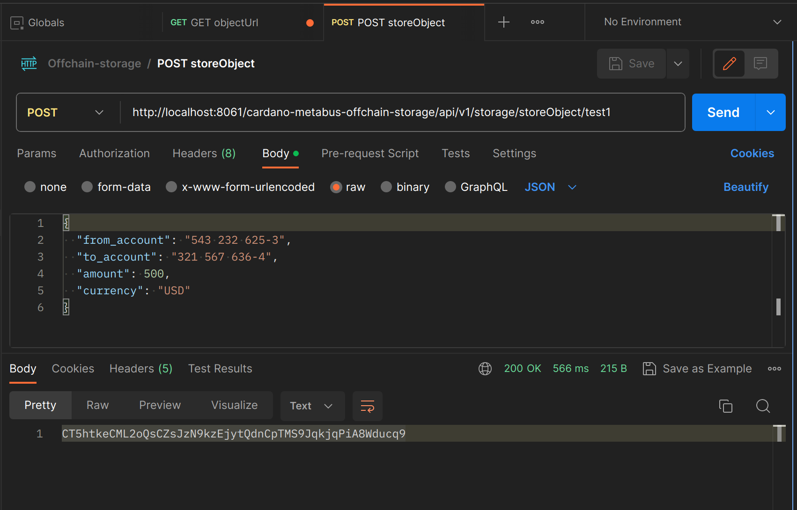
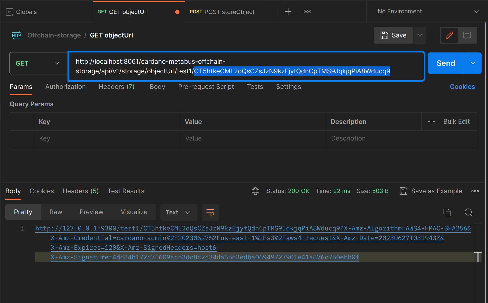
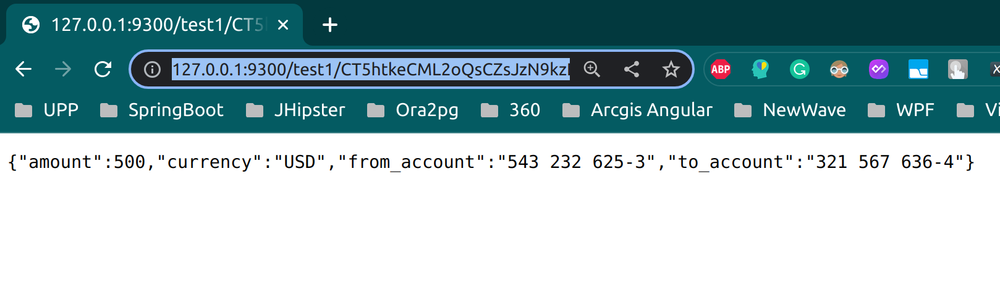

# Cardano Metabus Off-chain Storage service using MinIO

## 📖 Information
The project for Off-chain Storage Service, written in Java Spring, containerized in Docker, using MinIO storage. <br/>

API list:
1. **storeObject**: storing a canonicalized JSON object to bucket, with CID as object name
   - ```
     The JSON object is canonicalized using the JSON Canonicalization Scheme (RFC-r)
     ```
     Implemented refering to: https://github.com/erdtman/java-json-canonicalization
   - ``` 
     JSON object name must be a Content Identifier (CID) as defined by Multiformats (Protocol Labs)`
     ```
     Implemented refering to: https://github.com/multiformats/cid and https://github.com/ipld/java-cid
   - ```
     The hashing algorithm used must be Blake2b-256
     ```
     Implemented using `Blake2bUtil.blake2bHash256()` from `cardano-client-lib`
   - ```
     The CID must be represented in Multibase format with base58btc encoding
     ```
     Implemented using `toBase58()` refering to https://github.com/multiformats/java-multihash/blob/master/src/main/java/io/ipfs/multihash/Multihash.java
   - ```
     The write API should reject any invalid JSON objects
     ```
     Validated when canonicalizing.
     <br/><br/>

2. **objectUrl**: retrieving object URL via object name (CID)

## 🔨 Run the App
In case we just want to run the Off-chain Service API separately from the whole system: 

<b>1)</b> Open `Terminal` under `/metabus/cardano-metabus-offchain-storage`, run Maven-build for the application:
```
    mvn clean install
```
<b>2)</b> Open `Terminal` under `/metabus` folder. Run the service application and `Minio` on `Docker` container:
```
    docker compose --env-file ../.env.dev up
```
<b>3)</b> Open `Minio Console` in the browser:
```
    localhost:9310
```
<b>4)</b> Enter username and password:
```
    username : cardano-admin
    password : Cardano@12345
```
<b>5)</b> Explore the REST APIs from the Service:
<table style="width:100%">
  <tr>
    <th>Method</th>
    <th>Url</th>
    <th>Description</th>
    <th>Request Body</th>
    <th>Request Params</th>
    <th>Sample Results</th>
  </tr>
  <tr>
       <td>POST</td>
       <td>/<b>storeObject</b>/{bucketName}</td>
       <td>Storing a canonicalized JSON object to bucket, with CID as object name</td>
       <td><a href="#body-storeObject">Info</a></td>
       <td><a href="#param-storeObject">Info</a></td>
       <td><a href="#result-storeObject">Info</a></td>
  </tr>
  <tr>
       <td>GET</td>
       <td>/<b>objectUrl</b>/{bucketName}/{objectName}</td>
       <td>Retrieving object URL via object name (CID)</td>
       <td></td>
       <td><a href="#param-objectUrl">Info</a></td>
       <td><a href="#result-objectUrl">Info</a></td>
  </tr>
</table>

## ⛓️ Used Dependencies
* Spring Boot Web
* Minio
* Lombok
* Apache Commons Lang

## 📃 Valid Request Body

### <a id="body-storeObject">storeObject</a>
- Normal JSON:
  ```
  {
    "from_account": "543 232 625-3",
    "to_account": "321 567 636-4",
    "amount": 500,
    "currency": "USD"
  }
  ```
- Crazy JSON:
  ```
  {
    "1": {"f": {"f":  "hi","F":  5} ,"\n":  56.0},
    "10": { },
    "":  "empty",
    "a": { },
    "111": [ {"e":  "yes","E":  "no" } ],
    "A": { }
  }
  ```

## ⌨️ Valid Request Params

### <a id="param-storeObject">storeObject</a>
http://localhost:8080/api/v1/storage/storeObject/{bucketName}
```
    -> http://localhost:8080/api/v1/storage/storeObject/test-bucket-01
```

### <a id="param-objectUrl">objectUrl</a> 
http://localhost:8080/api/v1/storage/objectUrl/{bucketName}/{objectName}
```
   -> http://localhost:8080/api/v1/storage/objectUrl/test-bucket-01/zCT5htkeCML2oQsCZsJzN9kzEjytQdnCpTMS9JqkjqPiA8Wducq9
```

## 🖼️ Sample Results

### <a id="result-storeObject">storeObject</a>
<ul style="list-style-type:disc">
    <li></li>
</ul>

### <a id="result-objectUrl">objectUrl</a>
<ul style="list-style-type:disc">
    <li></li>
    <br/>
    <li></li>
</ul>