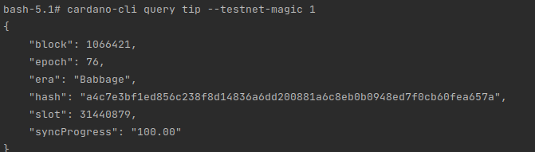

# cardano-metabus-txsubmitter

# For develoment
**Step 1:**: cd to `originate folder` and run this command to build target jars:
```
./mvnw clean install -DskipTests
```

**Step 2:** cd to `metabus folder` and run this command to start the relevant services:

```
docker compose --env-file ../.env.dev up --build pg4keycloak keycloak metabus-api metabus-jobproducer state-storage zookeeper kafka kafdrop metabus-cardano-node -d
```

**Step 3:** Wait for the node to be fully synced with cardano blockchain:
You can check the status of the node by following this command:

```
docker exec metabus-cardano-node cardano-cli query tip --testnet-magic 1
```
Keep spamming this command to check until the "syncProgress" is 100.00



**Step 3:** Run or debug Spring Boot cardano-metabus-txsubmitter project in ide and start developing (you can stop unrelevant services).

When you start this service there might be some error beacause there isn't any job topic in kafka,
dont worry, you just need to make a first request from metabu-api, then the job producer will create a
job topic on kafka, or you can open kafdrop UI at localhost:9000 and add the topic with name "dev.job.schedule"
# For running the whole project as docker container:
**Step 1:** cd to `metabus/cardano-metabus-txsubmitter folder`, type:

```
../../mvnw clean install
```

**Step 2:** cd to `metabus folder` and type:

```
docker compose --env-file ../.env.dev up --build pg4keycloak keycloak metabus-api metabus-jobproducer state-storage zookeeper kafka kafdrop metabus-cardano-node -d
```

Wait for the node to fully sync and type:
```
docker compose --env-file ../.env.dev up --build metabus-txsubmitter
```

When you start this service there might be some error beacause there isn't any job topic in kafka,
dont worry, you just need to make a first request from metabu-api, then the job producer will create a 
job topic on kafka, or you can open kafdrop UI at localhost:9000 and add the topic with name "dev.job.schedule"